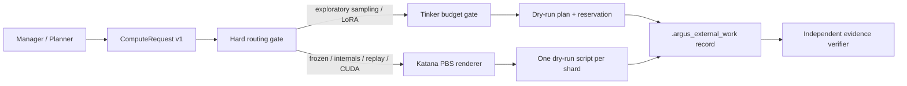

# Research Compute Broker

Status: dry-run planning and verification only. The broker cannot call Tinker,
open SSH sessions, or submit PBS jobs. Enabling live execution requires a
separate security review and adapter.

## System boundary



Argus owns task decomposition, review, and liveness. The compute broker owns
provider selection, spend admission, provider-safe plans, and evidence
acceptance. Agents never receive provider credentials and never construct
ad-hoc Tinker or PBS commands.

## Routing policy

| Requirement | Provider | Evidence authority |
|---|---|---|
| Prompt sanity check, concurrent sampling, standard LoRA prototype | Tinker | Exploratory only; always `frozen:false` |
| Hidden states or full-vocabulary logits | Katana | May be frozen after verification |
| Pinned revision, replay, CRN, critic training, main-table result | Katana | May be frozen after verification |
| Custom CUDA or private no-egress data | Katana | May be frozen after verification |
| Renderer or embedding without the hard requirements above | Katana by current conservative policy | Preserve the requested evidence class |

An explicit Tinker hint never overrides a Katana-only requirement. Selecting
Katana does not silently promote exploratory work into frozen evidence.

## Tinker budget policy

The working allocation starts from a USD 4,300 balance:

| Control | Default | Purpose |
|---|---:|---|
| Protected reserve | $1,800 | Kept outside automatic allocation |
| Automatic allocation ceiling | $2,500 | Maximum automatic exposure from the remaining balance |
| Reconciliation threshold | $2,250 | Blocks new reservations until actual spend is reconciled |
| Provider-lag buffer | $250 | Covers delayed usage reporting |
| Reservation multiplier | 1.25x | Covers estimate error before admission |
| Sampling / prompt cap | $50 per job | Limits exploratory inference blast radius |
| LoRA prototype cap | $200 per job | Limits exploratory training blast radius |

The append-only JSONL ledger is file-locked, fsynced, and idempotent by
`job_key`. A missing or malformed ledger fails closed. Version 1 accepts a
caller-calculated USD estimate and records a pinned price-snapshot digest; a
future live adapter must calculate that estimate from the official price data
and settle the actual charge before more budget is released.

Initialize once:

```bash
argus-compute init-budget \
  --ledger .argus_compute/tinker-budget.jsonl
```

The sample price snapshot under `.agents/skills/run-tinker/examples/` is
synthetic test data and must not be used to authorize real spend.

## Katana policy

- Configure the local site with `ARGUS_KATANA_USER=z5614191` and
  `ARGUS_KATANA_HOST=katana.restech.unsw.edu.au`; the defaults match this
  worktree's approved UNSW deployment.
- Use `/srv/scratch/nemesis/<project>/`; never run experiments from home.
- Render one PBS script per shard. Do not use a single monolithic job.
- Use `/opt/pbs/bin/qsub` and `/opt/pbs/bin/qstat -u z5614191` in a future live
  adapter. The current broker only records these argument vectors.
- Do not specify a queue or GPU model. Default resources are
  `select=1:ncpus=18:ngpus=1:mem=120gb`.
- Use two hours for smoke tests and twelve-hour checkpointed segments for
  normal work.
- A memory threshold such as `mem_per_gpu_gte_120` is allowed only with an
  explicit workload reason.
- Checkpoints must be append-only at episode granularity and deduplicate exact
  `(query, branch, seed)` keys.
- Frozen actors include the container digest, model snapshot digest, sampling
  configuration digest, and the actual GPU name and UUID.

## Standard commands

Create a request from the standard examples in `.agents/skills/route-compute/`,
then plan without executing:

```bash
argus-compute plan \
  --project-root /path/to/project \
  --ledger /path/to/project/.argus_compute/tinker-budget.jsonl \
  --request request.json \
  --price-snapshot price-snapshot.json \
  --capabilities tinker-capabilities.json
```

`--price-snapshot` and the ledger are required only if hard routing selects
Tinker. Planning writes an immutable ticket, a provider plan, and a canonical
`.argus_external_work` liveness record. The liveness record is terminal with
outcome `planned_dry_run`, so Argus does not mistake planning for a running job.

After a future adapter produces outputs, verification is independent of the
process exit code:

```bash
argus-compute verify \
  --project-root /path/to/project \
  --plan .argus_compute/plans/<job>.json \
  --manifest runs/<job>/manifest.json
```

Exit `0` means accepted evidence, `3` means readable but rejected evidence,
and `2` means invalid input or broker state.

## Agent Skills

The portable standard-format Skills live under `.agents/skills/`:

- `route-compute`
- `run-tinker`
- `run-katana`
- `verify-compute-run`

Argus-native role mirrors are packaged under `argus_skill/builtin_skills/` so
Planner, Engineer, and Reviewer receive the same contract when built-ins are
exported into a project.

## Model policy

Ultra is intentionally deferred. For the Codex backend, the initial standard
profile is `gpt-5.6-sol` with `max` effort:

```bash
export ARGUS_SKILL_MODEL="gpt-5.6-sol"
export ARGUS_SKILL_MANAGER_REASONING_EFFORT="max"
export ARGUS_SKILL_PLANNER_REASONING_EFFORT="max"
export ARGUS_SKILL_ENGINEER_INITIAL_REASONING_EFFORT="max"
export ARGUS_SKILL_ENGINEER_REASONING_EFFORT="max"
export ARGUS_SKILL_REVIEWER_REASONING_EFFORT="max"
```

For the Claude backend, set the primary model to `fable`. Argus automatically
adds the Claude Code alias `opus` as the fallback and passes `max` unchanged:

```bash
export ARGUS_SKILL_MODEL="fable"
export ARGUS_SKILL_MANAGER_REASONING_EFFORT="max"
export ARGUS_SKILL_PLANNER_REASONING_EFFORT="max"
export ARGUS_SKILL_ENGINEER_INITIAL_REASONING_EFFORT="max"
export ARGUS_SKILL_ENGINEER_REASONING_EFFORT="max"
export ARGUS_SKILL_REVIEWER_REASONING_EFFORT="max"
```

The fallback is used only when Fable is overloaded or unavailable. Explicit
ordered fallback chains are supported through `RunnerOptions.fallback_models`.

## Credential rules

1. Rotate any key ever pasted into chat, logs, shell history, or an issue.
2. The dry-run broker needs no Tinker API key.
3. A future live broker must receive Tinker credentials through a narrow,
   provider-scoped environment. Codex and Claude child processes automatically
   scrub `TINKER_*` secrets and secret-like `ARGUS_COMPUTE_*` variables while
   retaining their own backend authentication.
4. Do not globally combine an OpenAI key with a third-party
   `OPENAI_ENDPOINT`. Use a separate restricted credential and a reviewed
   provider-specific adapter if such a proxy is required.
5. Katana uses the SSH agent and PBS. Do not serialize private keys into
   requests, Skills, plans, manifests, or logs.

## Live execution acceptance gate

Live Tinker or Katana execution remains NO-GO until a follow-up change adds and
reviews all of the following:

- provider-scoped subprocesses with an allowlisted environment;
- official-price parsing plus actual-charge reconciliation;
- Tinker capability probing immediately before submission;
- SSH host-key pinning, PBS submit/status parsing, cancellation, and resume;
- append-only result manifests and artifact hashing;
- failure-injection tests for retries, duplicate submission, partial output,
  stale status, budget races, and twelve-hour preemption.
